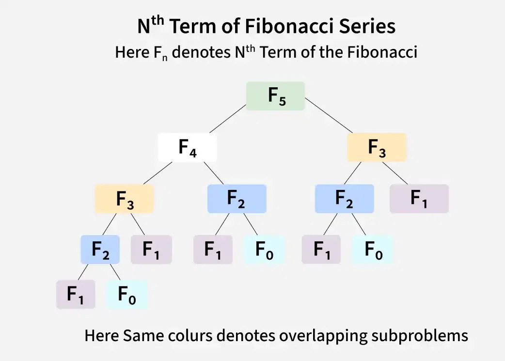

# ⚡ Introducción a la programación dinámica (DP)

## Breve dato histórico sobre la Programación Dinámica

La Programación Dinámica fue desarrollada en la década de 1950 por el matemático **Richard Bellman** mientras trabajaba en problemas de optimización para el Departamento de Defensa de EE. UU.

### ⭐ El dato curioso

Bellman eligió el nombre “Dynamic Programming” por razones políticas y estratégicas, no técnicas.  
En esa época, su jefe no veía con buenos ojos proyectos relacionados con matemáticas o investigación teórica, así que Bellman buscó un nombre que sonara:  

- práctico,  
- serio,  
- y aceptable para obtener financiación.

Él mismo contó años después:  
> “A mi jefe no le gustaban las palabras como ‘investigación’ o ‘matemáticas’.  
> Necesitaba un nombre que no pudiera oponerse a financiar.  
> Así nació ‘Dynamic Programming’.”

## Introducción a la Programación Dinámica (DP)

La **Programación Dinámica** es una técnica algorítmica comúnmente usada para optimizar soluciones recursivas cuando los mismos subproblemas se resuelven varias veces.

La idea principal de la DP es **almacenar las soluciones de los subproblemas para que cada uno se calcule solo una vez**.

## ¿Cómo funciona?

Para resolver problemas con DP, primero escribimos una solución recursiva donde los subproblemas se **superponen**; es decir, la función recursiva se llama varias veces con los mismos parámetros.

Para evitar calcular varias veces los mismos valores, almacenamos los resultados de estas llamadas recursivas.

Existen dos formas de hacerlo:

- **Top-Down (Memoización):** Guardamos los resultados durante la recursión para reutilizarlos.  
- **Bottom-Up (Tabulación):** Calculamos primero los casos más pequeños y vamos construyendo la solución hacia arriba.

## ¿Cuándo usar Programación Dinámica?

DP es útil cuando un problema tiene estas dos propiedades clave:

### 1. Subestructura óptima  

Esto significa que la solución óptima del problema puede obtenerse usando las soluciones óptimas de sus subproblemas.

**Ejemplo: Distancia mínima entre dos ciudades**  

Supongamos que queremos encontrar la distancia más corta para ir de la ciudad **A** a la ciudad **D**, pasando por ciudades intermedias **B** y **C**.  
Si conocemos:  

- La distancia mínima de **A** a **B**,  
- La distancia mínima de **B** a **C**,  
- La distancia mínima de **C** a **D**,  

entonces la distancia mínima de **A** a **D** puede construirse sumando esas distancias mínimas en el camino óptimo.  
Es decir, el problema grande (**A** a **D**) se resuelve con los resultados óptimos de sus subproblemas (**A** a **B**, **B** a **C**, **C** a **D**).  
Esta propiedad es fundamental para aplicar Programación Dinámica.

### 2. Subproblemas superpuestos  

El problema contiene subproblemas que se repiten varias veces.  
**Ejemplo:**  
Para calcular el número de Fibonacci en la posición \( n \), necesitamos calcular los números en las posiciones \( n-1 \) y \( n-2 \). El subproblema para \( n-2 \) aparece en múltiples ramas de la recursión.  
Puedes notar esta superposición al observar el árbol de recursión para Fibonacci, donde muchas llamadas se repiten.  

## 🔁 Antes de continuar: ¿Qué es una recurrencia?

Para poder entender bien la Programación Dinámica, primero debemos comprender el concepto de **recurrencia**.  
Una recurrencia es una **fórmula que expresa la solución de un problema en función de versiones más pequeñas del mismo problema**.

Es decir:  
📌 *Una recurrencia describe cómo un problema se descompone en subproblemas.*

Las **recurrencias** se estudian normalmente en asignaturas como:

- **Matemáticas Discretas**  
- **Algoritmos y Estructuras de Datos**  
- **Análisis de Algoritmos**

Y sí…  
> **🤓 *Las recurrencias suelen explicarse por primera vez en Matemáticas Discretas, una asignatura típica de la universidad.***  

### ¿Por qué necesitamos recurrencias en DP?

Porque la Programación Dinámica **parte siempre de una relación de recurrencia**.  
Primero entendemos *cómo se relacionan los subproblemas*, y luego usamos DP para optimizar esos cálculos.

Sin recurrencia ➜ no hay DP.

## 🧠 Ejemplos sencillos de recurrencias

### 1. Fibonacci  

Cada número se define como la suma de los dos anteriores:

- **F(n) = F(n-1) + F(n-2)**  
- **F(0) = 0**  
- **F(1) = 1**  

Este es un clásico porque tiene **subproblemas superpuestos**, por lo que es ideal para Programación Dinámica.  

### 2. Factorial  

Cada valor depende del anterior:

- **n! = n * (n-1)!**  
- **1! = 1**

Este problema *no* necesita DP porque no tiene subproblemas repetidos,  
pero es útil para entender la estructura de una recurrencia.  

### 3. Subir una escalera (pasos de 1 o 2 o 3)  

Si puedes subir 1 o 2 o 3 escalones, las formas de llegar al escalón *n* son:

- **formas(n) = formas(n-1) + formas(n-2) + formas(n-3)**
- **formas(0) = 1**  
- **formas(1) = 1**  
- **formas(2) = 2**  

Este es un ejemplo excelente para mostrar cómo una recurrencia conduce directamente a Programación Dinámica.  

## 🧩 ¿Cómo construir una recurrencia? (Guía práctica para los alumnos)

1. **Define el subproblema**  
   ¿Qué representa tu función?  
   *Ejemplo:* **F(n)** = “el n-ésimo número de Fibonacci”.

2. **Divide el problema en casos más pequeños**  
   ¿Cómo se puede resolver usando versiones más pequeñas?  
   *Ejemplo:* **F(n)** depende de **F(n-1)** y **F(n-2)**.

3. **Escribe la relación de recurrencia**  
   La fórmula que conecta los subproblemas.

4. **Define los casos base**  
   Son los valores desde los cuales se construye la solución.  
   *Ejemplo:* **F(0)** y **F(1)**.

## 🎯 Resumen  

- Una **recurrencia** es una fórmula que conecta el problema con sus versiones más pequeñas.  
- Es el **primer paso** antes de aplicar Programación Dinámica.  
- Las recurrencias ayudan a entender la estructura del problema claramente.  
- Una vez que tenemos la recurrencia, podemos optimizarla con dos métodos principales:  
  - **Memoización (Top-Down)**  
  - **Tabulación (Bottom-Up)**  

> Estos métodos los veremos en detalle en próximas clases, donde incluiremos ejemplos prácticos y código para que puedas entender cómo implementarlos y aprovechar al máximo la Programación Dinámica.

## Vamos a escribir algunas recurrencias

### 1. Suma de los primeros \( n \) números naturales  

Describe cómo calcular la suma de los números desde 1 hasta \( n \).

### 2. Potencias de un número  

Describe cómo calcular \( a^n \) (a elevado a la n).  

### 3. Número de maneras de caminar en línea recta  

Si das pasos de 1 o 3 unidades para recorrer una distancia \( n \), describe cómo calcular el número de formas diferentes de llegar al punto \( n \).

### 4. Número de formas de descomponer un número en sumas de 1, 2 y 3  

Describe cómo calcular de cuántas formas puedes escribir \( n \) como suma de números 1, 2 y 3 (por ejemplo, para 3:  
3 = 1+1+1, 1+2, 2+1, 3).

## 📝 [Problemas: Clase 11 – Introducción a la programación dinámica (DP)](https://www.hackerrank.com/problemas-clase-11)
