# 🟢—🔵 Representación de grafos

## Breve dato histórico sobre los grafos

La teoría de grafos comenzó en **1736** gracias a **Leonhard Euler**, uno de los matemáticos más influyentes de la historia.  
Euler resolvió el famoso problema de **los puentes de Königsberg**, demostrando que **no era posible** recorrer todos los puentes sin repetir ninguno.

  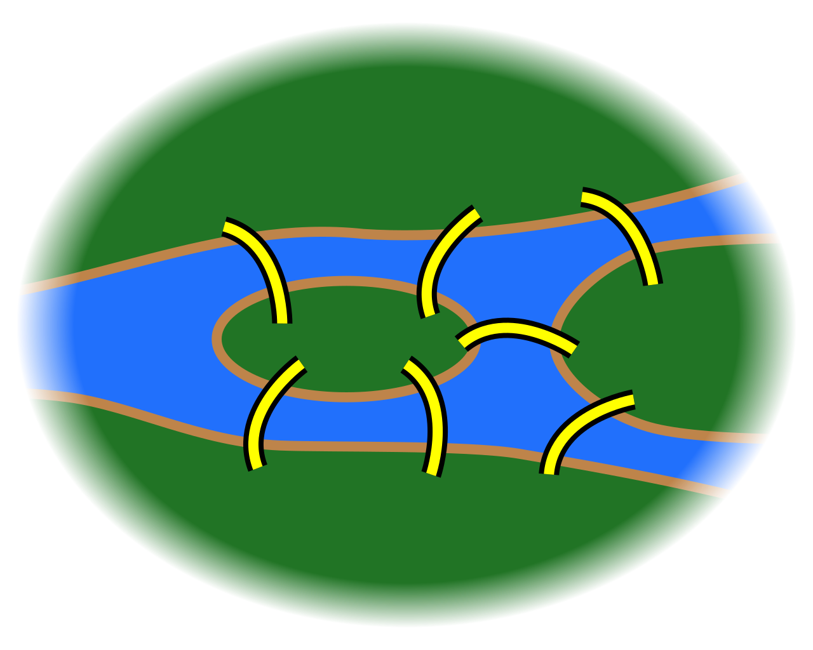 
  <em>Los 7 puentes del río Pregel en Königsberg.</em>

### ⭐ El dato curioso

Euler no estaba intentando inventar una teoría nueva. Solo quería resolver **un acertijo popular de la época**… ¡y terminó fundando un **área completa de las matemáticas**!

## ✔️ Importancia de los grafos

Los **grafos** son esenciales porque permiten representar y analizar **relaciones** entre elementos en casi cualquier contexto.

- **Modelan sistemas reales**: Redes sociales, mapas, rutas, internet, redes eléctricas.

- **Base de algoritmos fundamentales**: BFS, DFS, Dijkstra, Kruskal, Prim, flujo máximo.

- **Clave en inteligencia artificial**: Redes neuronales, grafos de conocimiento, sistemas de recomendación.

- **Optimización de procesos**: Rutas óptimas, logística, planificación, asignación de recursos.

## 🌐 Fundamentos de Teoría de Grafos

### 1. ¿Qué es un grafo?

Un **grafo** es una estructura formada por:

- Un conjunto de **vértices** (o nodos)
- Un conjunto de **aristas** (o arcos) que conectan pares de vértices

Representación habitual:

- **Vértices**: puntos
- **Aristas**: líneas o flechas entre puntos

  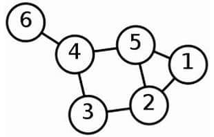

### Conectividad en grafos

Dos nodos están **conectados** si existe un camino entre ellos, es decir,  podemos ir de uno a otro a través de arcos:

  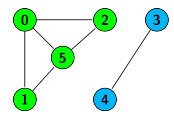

Por ejemplos, el **nodo 1 y el nodo 2 están conectados**, mientras que el **nodo 4 y el nodo 5 no están connectados**.

Si todos los nodos están conectados hablamos de **grafo conexo** (el grafo anterior no es conexo).

#### Componentes conexas

Si el grafo no es conexo, se divide en **componentes conexas**, donde:

- Dentro de cada componente todos los nodos están conectados.
- No existe conexión entre componentes distintas.

Por ejemplo, los nodos verdes forman una componente conexa y los nodos azules forman otra componente conexa.

### Grado de un nodo

El **grado de un nodo** es el número de aristas que inciden en él. Por ejemplo en el grafo anterior, el nodo 5 tiene grado 3, mientras que el nodo 4 tiene grado 1.

En **grafos dirigidos**:

- **Grado de entrada:** aristas que llegan al nodo  
- **Grado de salida:** aristas que salen del nodo

### Grafos dirigidos y no dirigidos

- **Grafo no dirigido:** las aristas **no tienen dirección**. Ejemplo: A — B (se puede ir en ambos sentidos)
- **Grafo dirigido:** las aristas **tienen dirección** (flechas). Ejemplo: A → B (se puede ir en una sola dirección)

  

#### Componentes fuertemente conexas (solo en grafos dirigidos)

Un conjunto de nodos es **fuertemente conexo** si puede recorrerse desde cualquier nodo del conjunto hacia cualquier otro respetando la dirección de las aristas. Por ejemplo en el sigiente grafo cada una de las componentes conexas tiene asignada un color.

  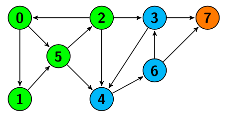

### Grafos ponderados

Un **grafo ponderado** es aquel donde las aristas poseen un **peso** o **costo**, que pueden representar:

- distancia
- tiempo
- capacidad
- costo económico

Se usan en algoritmos de rutas mínimas.

  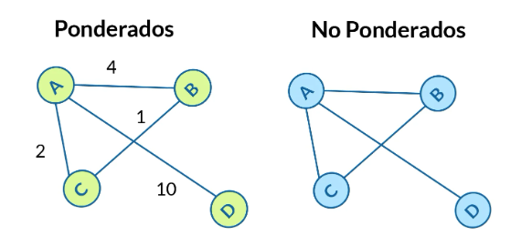

### Caminos y ciclos

- **Camino:** una secuencia de nodos donde cada nodo está conectado con el siguiente. Un grafo es un *camino* si puede ordenarse de forma lineal (cada nodo solo tiene vecino anterior y siguiente).

  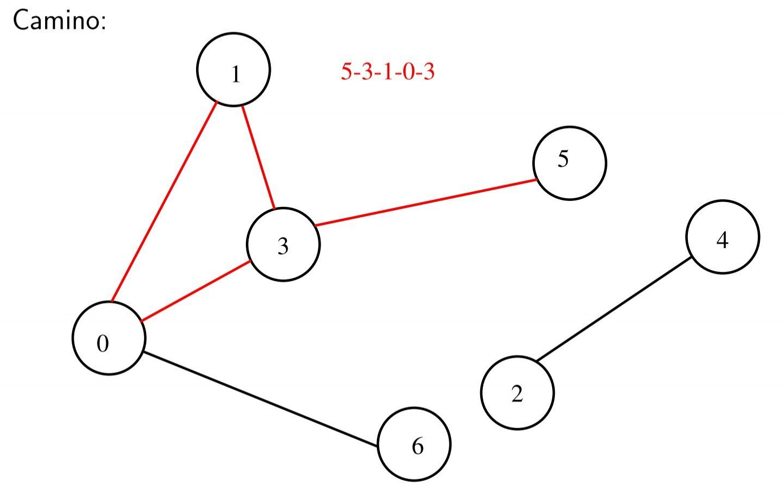

- **Ciclo:** secuencia de nodos donde cada nodo está conectado al siguiente y el último conecta con el primero. Es un camino cerrado.

  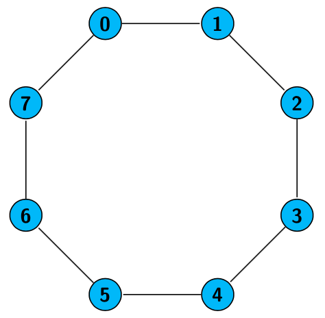

### Grafos especiales

#### Grafo completo

Todo par de vértices está conectado entre sí. Por ejemplo el grafo siguiente es un **grafo completo de 6 nodo**s.

  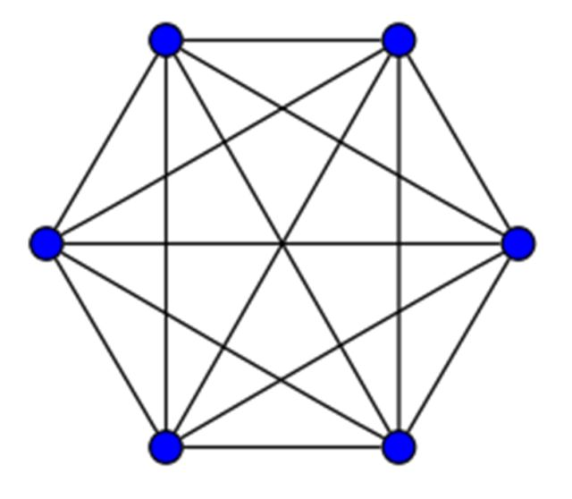

#### Árbol

Grafo que es: un grafo **conexo** y **sin ciclos**

Propiedades:

- Un único camino entre cualquier par de nodos
- Con **n nodos**, tiene **n−1 aristas**

  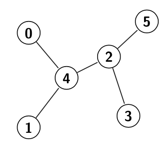

#### Bosque

Conjunto de árboles (grafo acíclico no conexo).

### Árboles arraigados

Un **árbol arraigado** tiene un nodo especial llamado **raíz**.

Conceptos:

- **Raiz:** nodo principal o nodo inicial. Ejemplo nodo 0.
- **Padre:** nodo superior en la jerarquía. Ejemplo el padre del nodo 6 es el nodo 3.
- **Hijos:** nodos descendientes directos. Ejemplo los hijos del nodo 1 son los nodos 4 y 5.
- **Hojas:** nodos sin hijos. Ejemplos nodos 4, 5 y 6.

  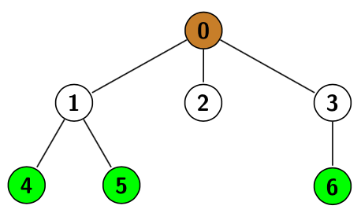

**Árbol binario:** es un arbol en el cual cada nodo tiene como máximo 2 hijos.

### Grafos generadores

Es el grafo que resulta de extraer un cierto número de aristas (pueden ser 0) de un grafo.

#### Árbol generador (Spanning Tree)

Es el grafo que resulta de extraer un cierto número de aristas (pueden ser 0) de un grafo, de modo que el grafo resultante sea un árbol.

Características:

- Contiene todos los nodos del grafo original
- No tiene ciclos
- Es un árbol

Clave en algoritmos como **[Kruskal](https://es.wikipedia.org/wiki/Algoritmo_de_Kruskal)** y **[Prim](https://es.wikipedia.org/wiki/Algoritmo_de_Prim)**.

## Representación de grafos

### Listas de adyacencia

Una **lista de adyacencia** representa un grafo asociando a cada vértice la lista de vértices a los que está conectado.

**Ventajas:**

- Uso eficiente de memoria en grafos dispersos.
- Recorrer vecinos es rápido.

**Desventaja:**

- Consultar si existe una arista puede tomar tiempo proporcional al grado del vértice.

### Matriz de adyacencia

Una **matriz de adyacencia** es una matriz cuadrada donde cada posición `(i, j)` indica si existe una arista entre esos dos vértices.

  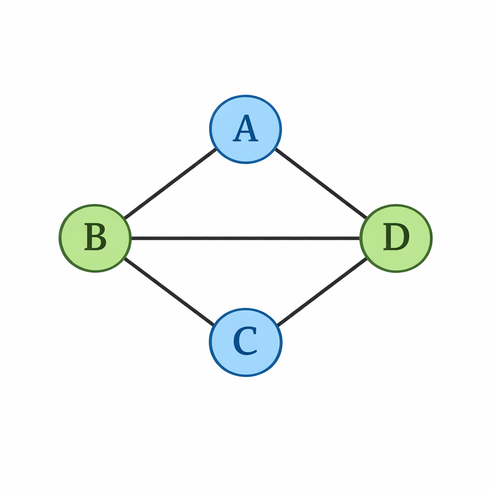

Por ejemplo para el grafo no dirigido anterior, su lista de adyacencia sería:

A: B, D  
B: A, C, D  
C: B, D  
D: A, B, C  

Mientras que su matriz de adyacencia sería:

|   | A | B | C | D |
|---|---|---|---|---|
| A | 0 | 1 | 0 | 1 |
| B | 1 | 0 | 1 | 1 |
| C | 0 | 1 | 0 | 1 |
| D | 1 | 1 | 1 | 0 |

**Ventajas:**

- Consultar si existe una arista es O(1).
- Útil en grafos densos.

**Desventaja:**

- Consume O(n²) memoria.

### Caminos y ciclos eulerianos

Un **camino euleriano** es un camino que usa **todas las aristas exactamente una vez**, pero no requiere volver al inicio.

Un **ciclo euleriano** es un camino que usa **todas las aristas exactamente una vez** y **regresa al vértice inicial**.

#### Condiciones en grafos no dirigidos

- **Camino euleriano:** el grafo tiene 0 o 2 vértices de grado impar.  
- **Ciclo euleriano:** todos los vértices tienen grado par.

#### Condiciones en grafos dirigidos

- **Camino euleriano:**  
  - Un nodo con `out = in + 1` (inicio)  
  - Un nodo con `in = out + 1` (final)  
  - Resto: `in = out`
- **Ciclo euleriano:**  
  - Para todos los nodos: `in = out`

  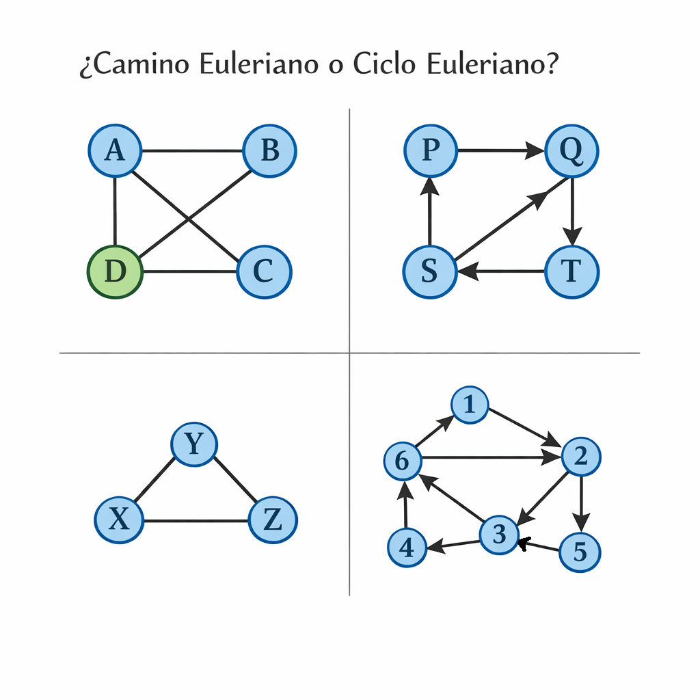

# 📝 [Problemas: Clase 16 – Representación de grafos](https://www.hackerrank.com/problemas-clase-16)  
