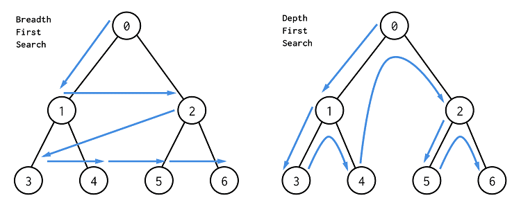

# 🔵—🟢 Recorrido en grafos: BFS (Búsqueda en anchura)

## Breve contexto histórico

El algoritmo de **búsqueda en anchura (Breadth-First Search, BFS)** surge de los primeros estudios formales sobre grafos y estructuras de datos durante el siglo **XX**, cuando comenzaron a desarrollarse los **primeros algoritmos de exploración sistemática de redes**.

BFS se popularizó con el desarrollo de la informática moderna, debido a que se adapta de forma natural al uso de **colas**, una estructura fundamental en programación.

> BFS es uno de los algoritmos básicos que todo estudiante de informática debe dominar.

## ✔️ Importancia del recorrido en grafos

Recorrer un grafo significa **visitar todos sus nodos siguiendo un criterio específico**.  
La búsqueda en anchura es especialmente importante porque:

- Permite encontrar **la distancia mínima** entre nodos en grafos no ponderados.
- Es base para numerosos algoritmos más avanzados.
- Se utiliza en **mapas**, **redes sociales**, **sistemas distribuidos** y **juegos**.
- Modela exploraciones **por niveles**, comunes en problemas reales.

<p align="center">
  
</p>

## 🌐 Fundamentos de la búsqueda en anchura (BFS)

### 1. ¿Qué es BFS?


La **búsqueda en anchura (BFS)** es un algoritmo de recorrido que explora los nodos de un grafo **nivel por nivel**, partiendo desde un nodo inicial.

- Primero visita todos los vecinos directos
- Luego los vecinos de esos vecinos
- Continúa hasta recorrer todo el grafo

### 2. Idea principal de BFS

La idea fundamental de BFS es:

> **Visitar primero los nodos más cercanos al origen.**

Para lograr esto, el algoritmo utiliza una **cola (queue)** que sigue el principio:

- **FIFO (First In, First Out)**

Esto garantiza que los nodos se procesen en el orden correcto.

### 3. Estructuras necesarias

Para implementar BFS se necesitan tres elementos básicos:

- Un **registro de nodos visitados**
- Una **cola**
- Un **nodo inicial**

Estas estructuras evitan:

- Visitas repetidas
- Ciclos infinitos

## 📦 Colas en programación (lo que hace posible BFS)

### ¿Qué es una cola?
Una **cola (queue)** es una estructura lineal que sigue el principio **FIFO (First In, First Out)**: el **primero que entra** es el **primero que sale**. Es análoga a una fila real: las personas son atendidas en el orden en que llegan.

### Operaciones básicas
- **Encolar (enqueue):** insertar al final de la cola
- **Desencolar (dequeue):** extraer desde el frente de la cola

Ejemplo conceptual:
```
[]
Encolar 0 -> [0]
Encolar 1 -> [0, 1]
Encolar 2 -> [0, 1, 2]
Desencolar -> sale 0 -> [1, 2]
```

### ¿Por qué BFS necesita una cola?
BFS explora **por niveles**. La cola asegura que todos los nodos del **nivel actual** se procesen **antes** que los del siguiente nivel.  
Sin esta garantía, **no habría distancias mínimas** en grafos no ponderados.

## 🐍 `deque` en Python: la cola correcta para BFS

### ¿Por qué no usar `list` como cola?
Hacer `pop(0)` en una lista es **O(n)** (desplaza elementos). En grafos grandes, esto provoca **TLE** (Time Limit Exceeded).

### Ventajas de `collections.deque`
- Inserción al final (`append`) en **O(1)**
- Extracción al inicio (`popleft`) en **O(1)**
- Semántica exacta de una **cola FIFO**

### Uso mínimo de `deque`
```python
from collections import deque

cola = deque()
cola.append(10)
cola.append(20)
cola.append(30)

x = cola.popleft()  # 10
```

> En BFS: `append()` para **encolar vecinos** recién descubiertos y `popleft()` para **procesar** el siguiente nodo del nivel.


## 🔄 Funcionamiento del algoritmo BFS

### Pasos del algoritmo

1. Marcar el nodo inicial como visitado.
2. Insertarlo en una cola.
3. Mientras la cola no esté vacía:
   - Extraer el primer nodo
   - Visitar todos sus vecinos no visitados
   - Marcar y encolar cada vecino

### Ejemplo paso a paso

Partiendo del nodo **0** en el siguiente grafo (no dirigido):

```
0: 1, 2
1: 0, 3, 4
2: 0, 5
3: 1
4: 1, 5
5: 2, 4
```

**Orden de recorrido BFS desde 0:**

```
0 → 1 → 2 → 3 → 4 → 5
```

Primero se recorren los nodos más cercanos (nivel 1: 1 y 2), luego los del nivel 2 (3, 4, 5).

## 🧠 Propiedades de BFS

- Garantiza el **camino más corto** en grafos no ponderados.
- Funciona en grafos **dirigidos y no dirigidos**.
- Es equivalente a un **recorrido por niveles** en árboles.
- Permite detectar **componentes conexas**.

## ⏱️ Complejidad del algoritmo

| Tipo | Complejidad |
|----|------------|
| Tiempo | **O(V + E)** |
| Memoria | **O(V)** |

Donde:

- **V** es el número de vértices
- **E** es el número de aristas


## 🛠️ Implementación del algoritmo BFS (recorrido)

```python
from collections import deque

def bfs(adj, inicio):
    """
    adj: lista de listas, adj[u] contiene los vecinos de u
    inicio: nodo inicial (int)
    return: lista con el orden de visita BFS
    """
    n = len(adj)
    visited = [False] * n
    order = []

    visited[inicio] = True
    q = deque([inicio])

    while q:
        u = q.popleft()
        order.append(u)
        for v in adj[u]:
            if not visited[v]:
                visited[v] = True
                q.append(v)
    return order

if __name__ == "__main__":
    # Ejemplo (no dirigido): 0-1-3, 1-4, 0-2-5, 4-5
    adj = [
        [1, 2],      # 0
        [0, 3, 4],   # 1
        [0, 5],      # 2
        [1],         # 3
        [1, 5],      # 4
        [2, 4]       # 5
    ]
    orden_visita = bfs(adj, 0)
    print("Orden BFS desde 0:", orden_visita)
```

**Salida esperada:**

```
Orden BFS desde 0: [0, 1, 2, 3, 4, 5]
```


## 📏 Cálculo de **distancias mínimas** (en número de aristas)

```python
from collections import deque

def bfs_distancias(adj, inicio):
    """
    adj: lista de listas, adj[u] contiene los vecinos de u
    inicio: nodo inicial (int)
    return: lista dist, donde dist[v] es la distancia mínima desde 'inicio' a v,
            o -1 si v es inalcanzable
    """
    n = len(adj)
    dist = [-1] * n
    dist[inicio] = 0

    q = deque([inicio])

    while q:
        u = q.popleft()
        for v in adj[u]:
            if dist[v] == -1:
                dist[v] = dist[u] + 1
                q.append(v)
    return dist

if __name__ == "__main__":
    # Mismo grafo del ejemplo anterior
    adj = [
        [1, 2],      # 0
        [0, 3, 4],   # 1
        [0, 5],      # 2
        [1],         # 3
        [1, 5],      # 4
        [2, 4]       # 5
    ]
    dist = bfs_distancias(adj, 0)
    print("Distancias mínimas desde 0:", dist)
```

**Salida esperada:**

```
Distancias mínimas desde 0: [0, 1, 1, 2, 2, 2]
```


## ⚠️ Errores comunes

- No marcar nodos como visitados **al encolar** (puede producir duplicados y colas enormes).
- Usar una **pila** en lugar de una **cola** (eso implementa DFS, no BFS).
- Pretender calcular rutas de menor **costo** en grafos **ponderados** con BFS (para eso, usa **Dijkstra**).


## 🧪 Mini‑ejercicio guiado (opcional)

1) Implementa una cola con `deque` y simula en papel el orden de salida para las inserciones `[0,1,2,3]`.  
2) Dado un grafo dirigido, muestra cómo varía el orden BFS al cambiar el nodo inicial.  
3) Modifica `bfs_distancias` para que, además de `dist`, retorne `padre` y puedas reconstruir el **camino mínimo** a cualquier destino.


# 📝 [Problemas: Clase 17 - Recorrido en grafos BFS](https://www.hackerrank.com/problemas-clase-17)
